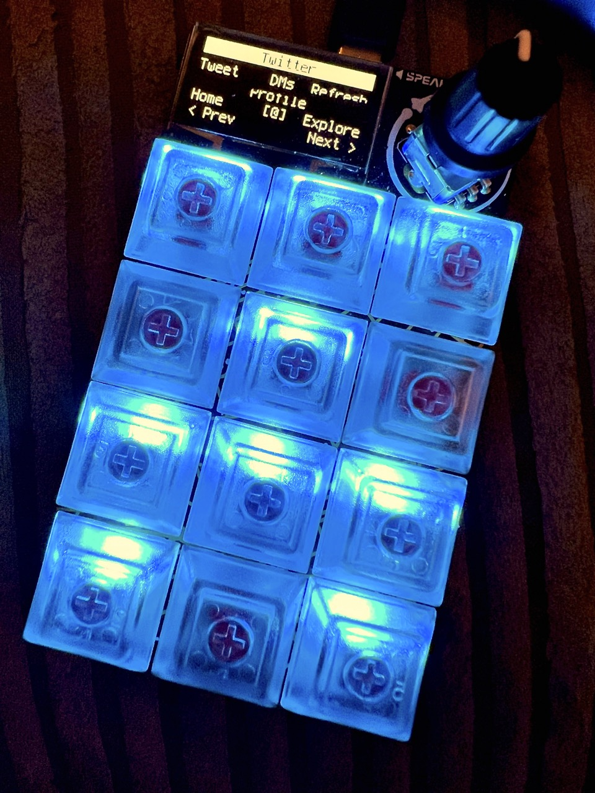

# Adafruit Macropad RP2040 - CircuitPython code

This repository contains the configurations I use with the [Adafruit Macropad RP2040](https://www.adafruit.com/product/5128) hardware keypad.

This is a set of modifications to the code from the [MACROPAD Hotkeys tutorial](https://learn.adafruit.com/macropad-hotkeys/) by [Phillip Burgess](https://learn.adafruit.com/users/pburgess). It is not a direct fork due to the way the Adafruit Learning System repository contains all of the modules as subdirectories. I'm attempting to watch for any useful updates upstream.



## Requirements

- [CircuitPython 7.x for Macropad RP2040](https://circuitpython.org/board/adafruit_macropad_rp2040/)
  - currently running on *7.1.1*
- [CircuitPython libraries](https://circuitpython.org/libraries) (in a `/lib` folder on the `CIRCUITPYTHON` volume):
  - adafruit_display_shapes
  - adafruit_display_text
  - adafruit_hid
  - adafruit_midi
  - adafruit_debouncer.mpy
  - adafruit_macropad.mpy
  - adafruit_pixelbuf.mpy
  - adafruit_simple_text_display.mpy
  - neopixel.mpy

A simple way to install the required CircuitPython dependencies to `/lib` is to [use circup](https://github.com/adafruit/circup) after `code.py` and the `/macros` folder have been copied to the mounted `CIRCUITPYTHON` drive.

```shell
$ circup install --auto
```

## Configuration

The contents of this repository are macros to work with applications running on macOS.

### Alternate version

The `alt-font` branch contains a modification using a different bitmap font for the display.
