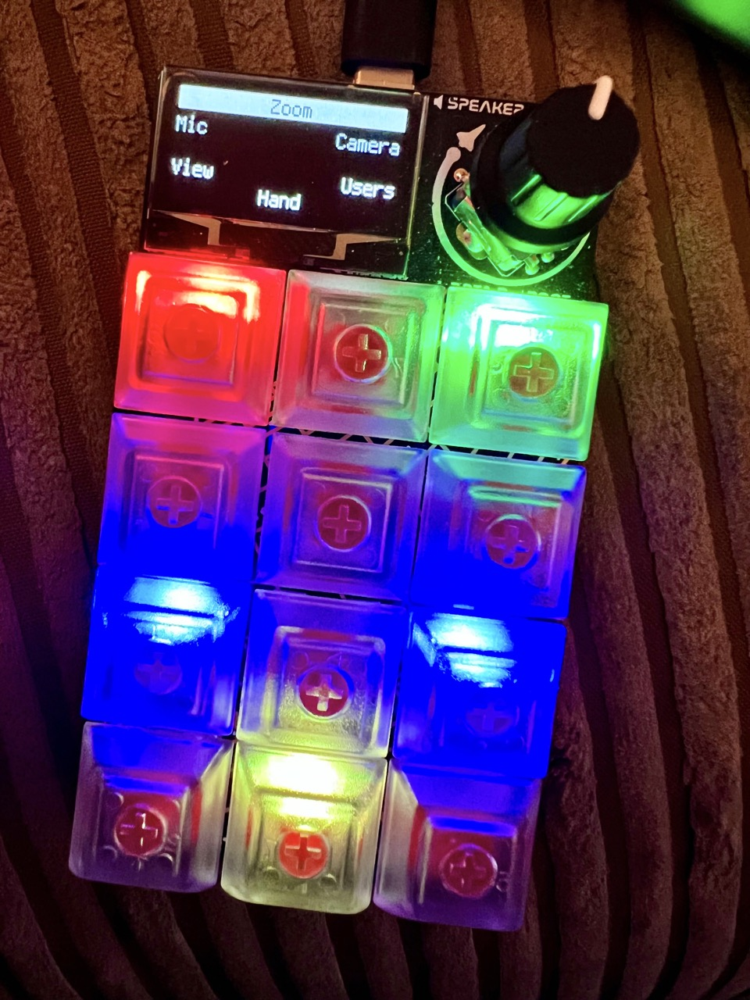

# Adafruit Macropad RP2040 - CircuitPython code

This repository contains the configurations I use with the [Adafruit Macropad RP2040](https://www.adafruit.com/product/5128) hardware keypad.

This is a set of modifications to the code from the [MACROPAD Hotkeys tutorial](https://learn.adafruit.com/macropad-hotkeys/) by [Phillip Burgess](https://learn.adafruit.com/users/pburgess). It is not a direct fork due to the way the Adafruit Learning System repository contains all of the modules as subdirectories.



## Requirements

- [CircuitPython 9.x for Macropad RP2040](https://circuitpython.org/board/adafruit_macropad_rp2040/)
  - currently running on *9.0.4*
- [CircuitPython libraries](https://circuitpython.org/libraries) (in a `/lib` folder on the `MACROPAD` volume) - see below for a quick way to install these without downloading the whole bundle:
  - adafruit_display_shapes
  - adafruit_display_text
  - adafruit_hid
  - adafruit_midi
  - adafruit_debouncer
  - adafruit_macropad
  - adafruit_pixelbuf
  - adafruit_simple_text_display
  - neopixel

A simple way to install the required CircuitPython dependencies to `/lib` is to [use circup](https://github.com/adafruit/circup) after `code.py` and the `/macros` folder have been copied to the mounted `MACROPAD` volume.

```shell
$ circup install --auto
```

It's like living in the future!

[Read more about installing and using Circup](https://learn.adafruit.com/keep-your-circuitpython-libraries-on-devices-up-to-date-with-circup).

## Configuration

The contents of this repository are macros to work with applications running on macOS. If you don't use a Mac, you will almost certainly need to replace references to `Keycode.COMMAND` with a platform-specific alternative (probably `Keycode.CONTROL`, YMMV).


### Changelog

- 2024-05-21: Updated to CircuitPython 9.x

---

### Alternate version

The `alt-font` branch contains a modification / work-in-progess using a different bitmap font for the display.
